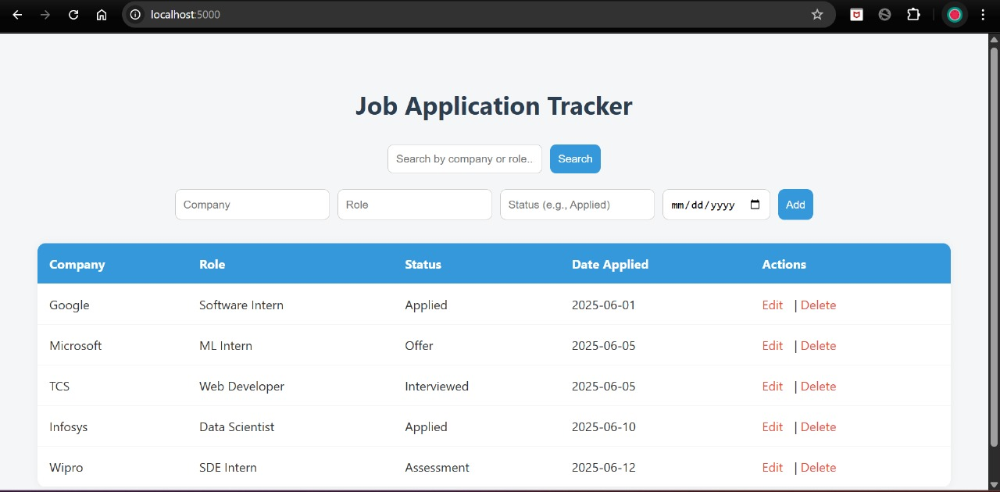

# 🎯 Job Application Tracker

A simple, beginner-friendly web application to track your job or internship applications — built using **Flask** and **SQLite**.

## 📌 Features
- Add new job applications (Company, Role, Status, Date Applied)
- View all saved jobs in a table
- Delete entries
- Clean and simple UI

## 🛠️ Tech Stack
- Python 3
- Flask (Web Framework)
- SQLite (Database)
- HTML + CSS (Frontend)

## 🚀 Getting Started

### 1. Clone the repo
```bash
git clone https://github.com/your-username/job-tracker.git
cd job-tracker
```

### 2. Install dependencies
```bash
pip install -r requirements.txt
```

### 3. Run the app
```bash
python app.py
```

### 4. Open in browser
Visit [http://localhost:5000](http://localhost:5000)

---

## 📸 Screenshot


## 📂 Folder Structure
```
job-tracker/
├── app.py
├── requirements.txt
├── templates/
│   └── index.html
├── static/
│   └── style.css
└── README.md
```

## 🧠 Why this project?
Great for beginners to learn how full-stack apps work with just Python and HTML/CSS — no JavaScript frameworks required!

---

## 📄 License
MIT — feel free to use and modify.
